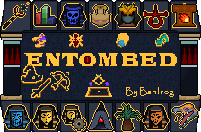

# DarkTransluscent (by Rooxe)

  

Dark Transluscent is a twist on the regular dark theme, whereas everything is either transluscent or dark. Since transluscent does not always work, in some cases the use of color has been adapted in the borders of the icon (friends icon, spells, others). Please note that if you have further icons I am not using (ironman, low level spells) that you can either reach out and I will do it when I find time or you can do it and send the resource to me and I will implement it with a credit to you.
Feel free to reach out to Rooxe if you have questions to the pack!

## Resizeable mode
  

## Screenshots
  
  
  
  
  
  
 
