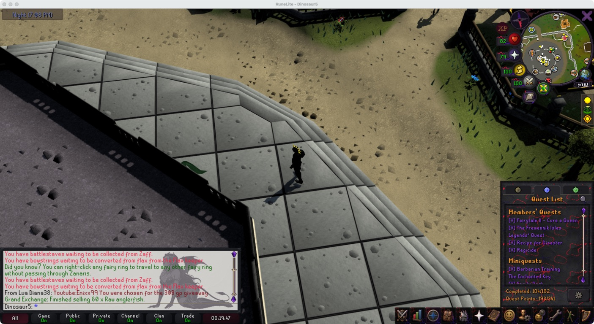
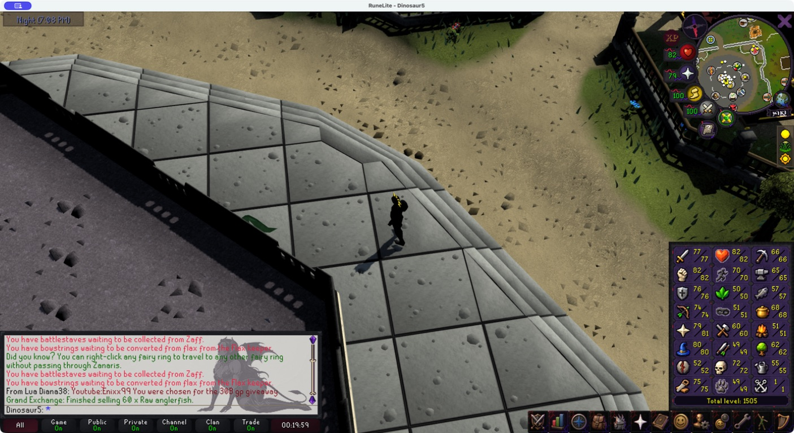
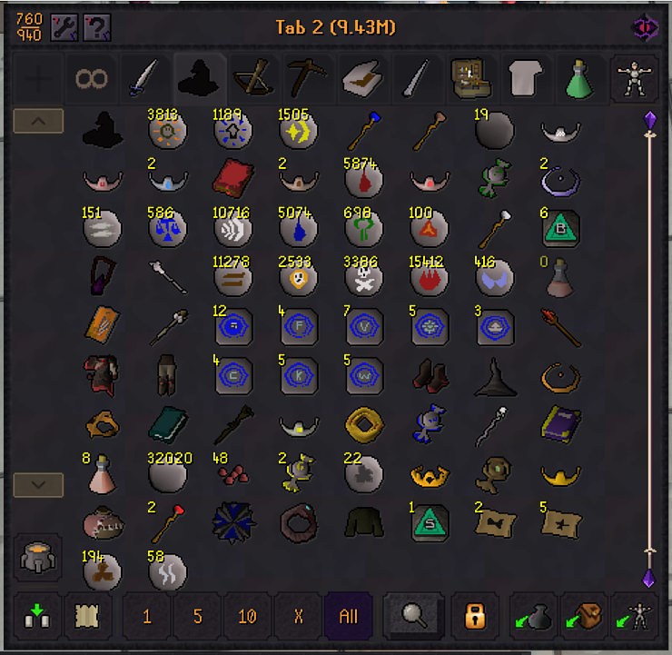
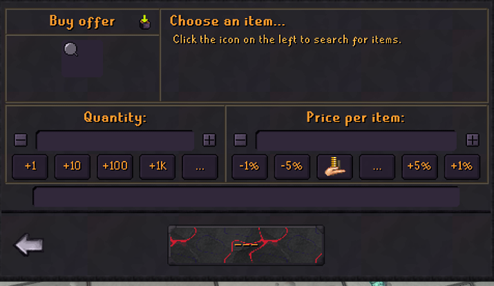

# Obsidian Marble 1.0.0

Created by Dinosaur5.

A polished dark interface with demonic accents, obsidian surfaces, muted purple
and oxblood details, and clean custom icons designed to stay readable without
overpowering the game.

## Local installation

Point the Resource Packs plugin's custom pack path at this directory, without a
trailing slash:

`/Users/dinosaur5-homefolder/Desktop/osrs-resource-pack/pack`

Keep RuneLite's Interface Styles `Gameframe` setting on `Default`, then restart
the Resource Packs plugin after changing assets.

Keep RuneLite's Interface Styles `Gameframe` setting on `Default`. Restart or
reload the Resource Packs plugin after changing assets.

The pack intentionally preserves gameplay-critical prayer, spell, emote, bank,
and minimap symbols for instant recognition.

## Interface previews

